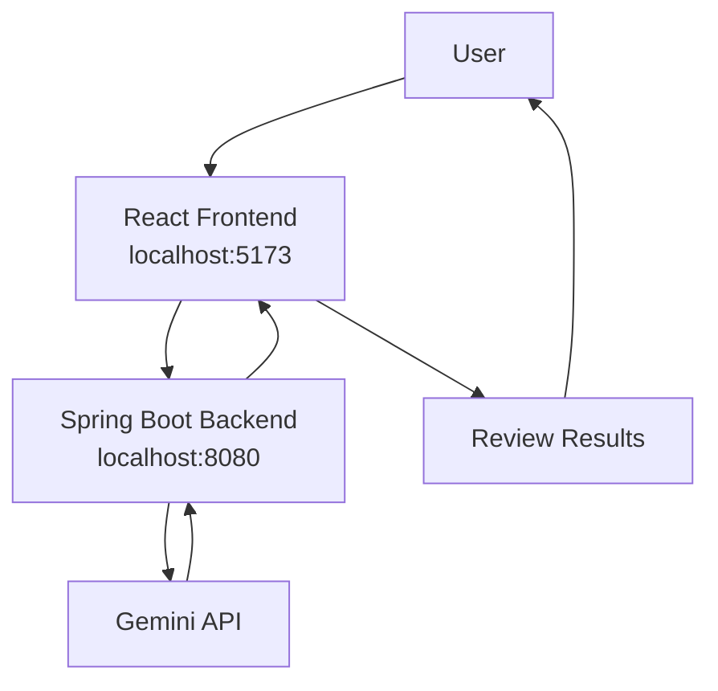
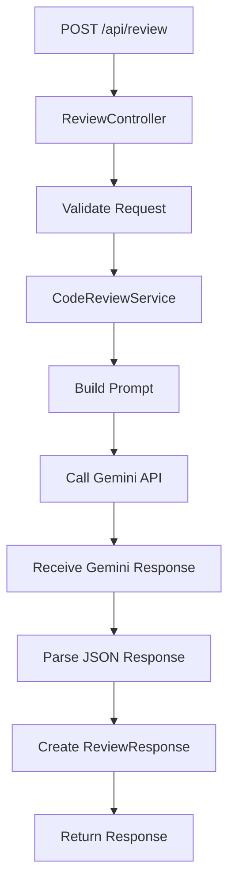
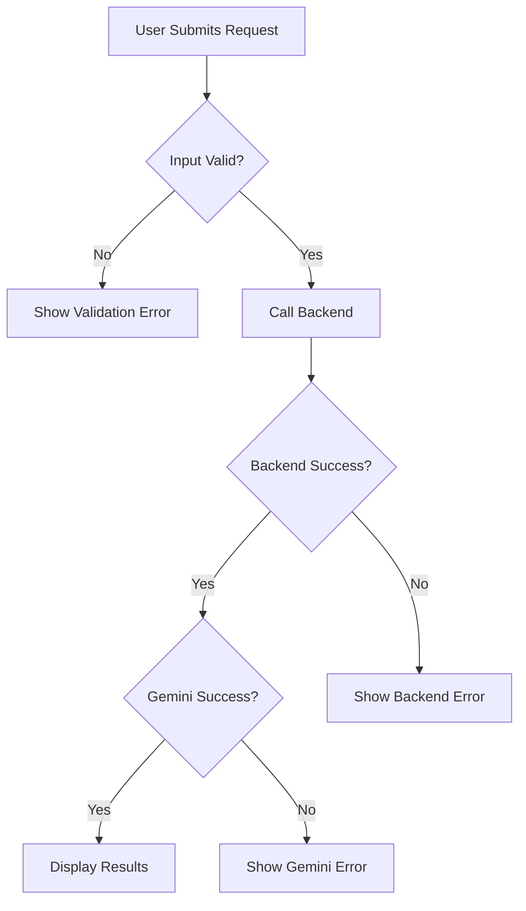
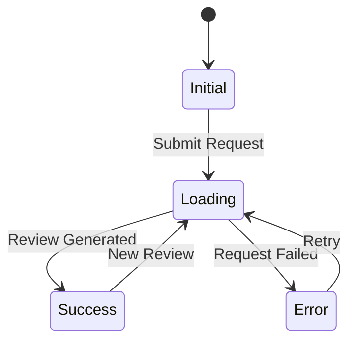
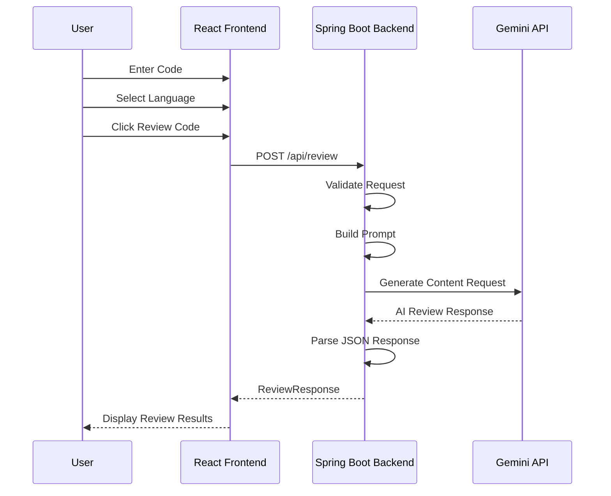
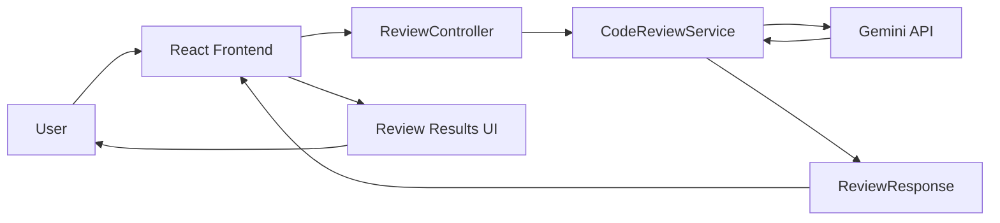

# Application Flow Document

# AI-Powered Code Reviewer

**Version:** 1.0

---

# 1. Purpose

This document describes how users interact with the application and how data flows between the frontend, backend, and Gemini API.

The objective is to provide a clear understanding of the application's behavior from user action to AI-generated review output.

---

# 2. High-Level Flow



---

# 3. User Journey

## Step 1: Open Application

The user opens the AI-Powered Code Reviewer application at:

```text
http://localhost:5173
```

The homepage displays:

* Project title
* Programming language dropdown
* Code input area
* Review button

---

## Step 2: Select Programming Language

The user selects a programming language.

Available options:

* Java
* JavaScript
* Python
* C++

The selected language helps the AI understand the syntax and context of the submitted code.

---

## Step 3: Paste Code

The user pastes a code snippet into the code editor.

Example:

```java
public class Main {
    public static void main(String[] args) {
        System.out.println("Hello World");
    }
}
```

Validation checks:

* Code must not be empty
* Code must be within the maximum limit of 5000 characters

---

## Step 4: Submit Review Request

The user clicks:

```text
Review Code
```

Frontend actions:

1. Validate form fields
2. Disable review button
3. Display loading indicator
4. Send API request to backend

---

# 4. Frontend → Backend Flow

## API Request

```http
POST http://localhost:8080/api/review
Content-Type: application/json
```

Request Body:

```json
{
  "language": "Java",
  "code": "user code here"
}
```

---

# 5. Backend Processing Flow

Package:

```text
io.github.atsin6.codereviewer
```



---

## Step 1: Receive Request

`ReviewController` receives the incoming request.

Responsibilities:

* Validate request body
* Forward request to service layer

---

## Step 2: Build AI Prompt

`CodeReviewService` generates a structured prompt.

Example:

```text
You are a senior software engineer.

Review the following Java code.

Return ONLY valid JSON with no extra text:

{
  "bugs": "",
  "performance": "",
  "bestPractices": "",
  "improvedCode": ""
}

Code:
<user code>
```

---

## Step 3: Call Gemini API

Backend sends a request to:

```text
https://generativelanguage.googleapis.com/v1beta/models/gemini-2.5-flash:generateContent
```

---

## Step 4: Parse Response

Backend:

* Extracts generated text
* Parses JSON response
* Maps response to `ReviewResponse`

---

## Step 5: Return Response

Example:

```json
{
  "bugs": "No major bugs found.",
  "performance": "Consider StringBuilder for repeated string concatenation.",
  "bestPractices": "Add validation checks.",
  "improvedCode": "..."
}
```

---

# 6. Frontend Result Flow

After receiving the response:

1. Stop loading spinner
2. Enable Review button
3. Render review results

Displayed sections:

### Bugs & Issues

Potential bugs and risky patterns.

### Performance Suggestions

Optimization opportunities.

### Best Practices

Maintainability and code quality suggestions.

### Improved Code

AI-generated improved version of the submitted code.

---

# 7. Error Handling Flow



---

## Case 1: Empty Input

Frontend blocks submission.

Message:

```text
Please enter code before submitting.
```

---

## Case 2: Backend Validation Failure

Response:

```http
400 Bad Request
```

Message:

```text
Invalid request. Please check your input.
```

---

## Case 3: Gemini API Failure

Response:

```http
500 Internal Server Error
```

Message:

```text
Unable to generate review. Please try again later.
```

---

## Case 4: Network Failure

Message:

```text
Connection failed. Please check your network.
```

---

# 8. Application States

| State   | Description                    |
| ------- | ------------------------------ |
| Initial | Form visible, no results       |
| Loading | Form disabled, spinner visible |
| Success | Review results displayed       |
| Error   | Error message displayed        |

---

## State Diagram



---

# 9. Sequence Diagram



---

# 10. Complete End-to-End Application Flow



---

# 11. MVP Flow Summary

1. User opens the application.
2. User selects a programming language.
3. User pastes code into the editor.
4. User clicks Review Code.
5. React sends request to Spring Boot backend.
6. Backend validates request.
7. Backend builds Gemini prompt.
8. Gemini analyzes the submitted code.
9. Backend parses the AI response.
10. Backend returns a structured JSON response.
11. React displays:

    * Bugs & Issues
    * Performance Suggestions
    * Best Practices
    * Improved Code
12. User reviews the feedback.

---

# 12. Success Criteria

The application flow is considered successful if:

* User can submit code successfully.
* Backend processes requests correctly.
* Gemini generates meaningful feedback.
* Results are displayed in structured sections.
* Validation and error handling work as expected.
* End-to-end workflow completes within a few seconds.
