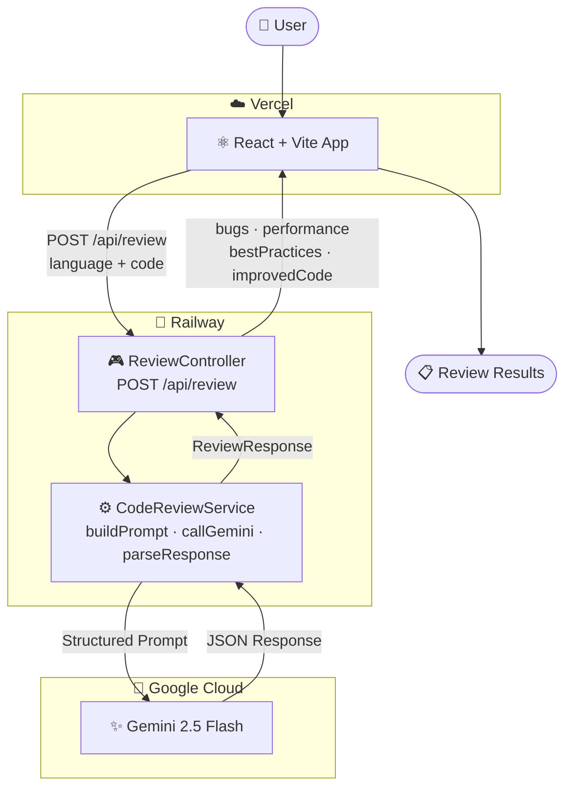

# 🔍 AI-Powered Code Reviewer

<div align="center">


An intelligent web application that allows developers to paste source code and receive instant AI-generated feedback using Google's Gemini LLM.

**[🚀 Live Demo](https://ai-code-reviewer-seven-vert.vercel.app)** • **[📂 GitHub](https://github.com/atsin6/ai-code-reviewer)**

</div>

---

## ✨ Features

- 🌐 **Multi-language Support** — Java, JavaScript, Python, C++
- ⚡ **Instant Analysis** — Structured AI feedback in seconds
- 🐛 **Bugs & Issues** — Identification of errors and risky patterns
- 🚀 **Performance Suggestions** — Tips to optimize code efficiency
- ✅ **Best Practices** — Recommendations for maintainability and coding standards
- 🔁 **Improved Code** — A cleaner, revised version of your snippet

---

## 🛠 Tech Stack

| Layer | Technology |
|-------|-----------|
| Frontend | React + Vite, CSS, Fetch API |
| Backend | Java 21, Spring Boot 4.0.6, WebClient |
| AI | Google Gemini API (gemini-2.5-flash) |
| Frontend Deploy | Vercel |
| Backend Deploy | Railway |
| Build Tool | Maven + Lombok |

---

## 🏗 Architecture



---

## ⚙️ Getting Started

### Prerequisites

- [Node.js](https://nodejs.org/) (v18+)
- [JDK 21](https://adoptium.net/)
- [Maven](https://maven.apache.org/)
- [Google Gemini API Key](https://aistudio.google.com/app/apikey) (free)

---

### 1. Clone the Repository

```bash
git clone https://github.com/atsin6/ai-code-reviewer.git
cd ai-code-reviewer
```

---

### 2. Backend Setup

```bash
cd code-reviewer
```

Create a `.env` file in the `code-reviewer/` directory:

```env
GEMINI_API_KEY=your_actual_api_key_here
```

> ⚠️ Never commit your API key. The `.env` file is already in `.gitignore`.

Run the Spring Boot application:

```bash
mvn spring-boot:run
```

Backend starts at: `http://localhost:8080`

Test it:
```bash
curl http://localhost:8080/api/health
# Expected: "Server is running!"
```

---

### 3. Frontend Setup

```bash
cd frontend
npm install
npm run dev
```

Frontend starts at: `http://localhost:5173`

---

## 📖 Usage

1. Open `http://localhost:5173` in your browser
2. Select your programming language from the dropdown
3. Paste your code snippet into the editor
4. Click **Review Code**
5. Wait a few seconds for Gemini to analyze
6. Read the structured feedback in 4 sections

---

## 📡 API Reference

### `POST /api/review`

**Request:**
```json
{
  "language": "Java",
  "code": "your code here"
}
```

**Response:**
```json
{
  "bugs": "Potential ArrayIndexOutOfBoundsException on line 5.",
  "performance": "Consider using StringBuilder for string concatenation.",
  "bestPractices": "Add input validation before processing.",
  "improvedCode": "// improved version here"
}
```

### `GET /api/health`
```
"Server is running!"
```

---

## 📚 Project Documentation

| Document | Description |
|----------|-------------|
| [PRD](./1_PRD.md) | Problem statement, goals, target users, and core features |
| [App Flow](./2_AppFlow.md) | User journey and data flow between frontend, backend, and Gemini API |
| [UI/UX Brief](./3_UIUXBrief.md) | Interface design, component structure, and visual style |
| [Backend Schema](./4_BackendSchema.md) | Backend architecture, API contracts, and data models |
| [TRD](./5_TRD.md) | Full technology stack, system architecture, and functional requirements |
| [Implementation Plan](./6_ImplementationPlan.md) | Step-by-step development roadmap |

---

## 🔮 Future Enhancements

- [ ] User authentication & review history
- [ ] GitHub integration for reviewing PRs directly
- [ ] Redis caching to reduce API calls
- [ ] Syntax-highlighted code editor (Monaco/CodeMirror)
- [ ] Support for multiple AI providers
- [ ] Rate limiting and API abuse prevention
- [ ] File upload support

---

## 🔒 Security

- Gemini API key stored only as environment variable on Railway
- Never exposed to frontend or committed to source code
- CORS restricted to known frontend origins

---

## 📄 License

This project is open source and available under the [MIT License](LICENSE).