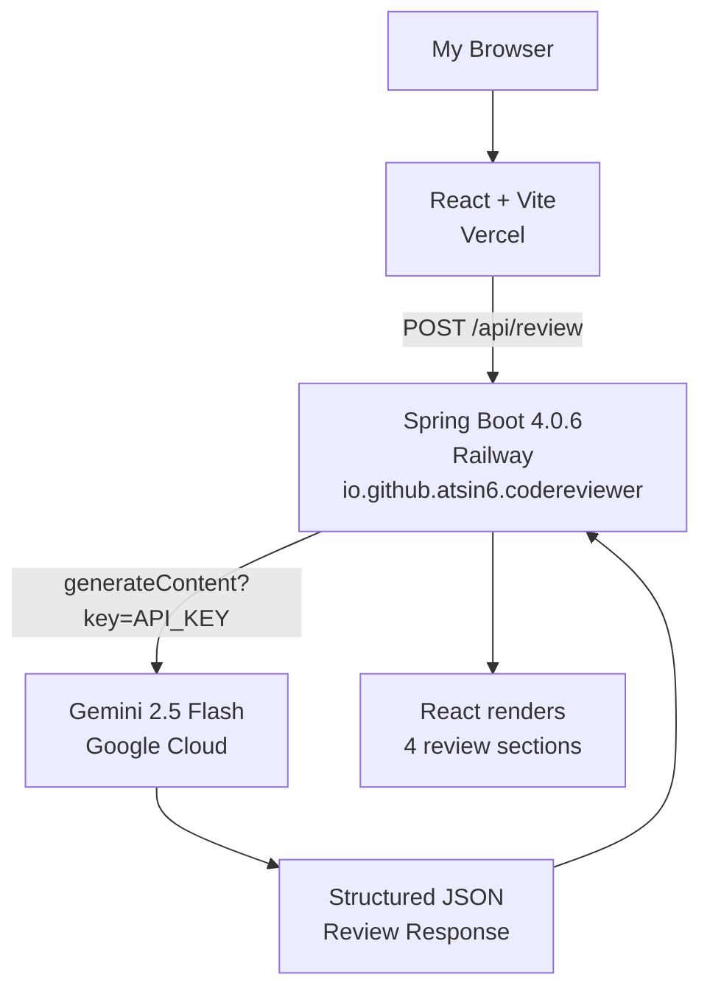

# AI-Powered Code Reviewer

**Internship Screening Submission | Option 3: AI-Assisted Prototype**
**Atul Pal | atsin6 | Full Stack Developer Internship**

---

## Project Links

* **Live Demo:** https://ai-code-reviewer-seven-vert.vercel.app
* **GitHub Repository:** https://github.com/atsin6/ai-code-reviewer

---

## Project Overview

I built an AI-Powered Code Reviewer — a full-stack web application where developers can paste source code and get instant AI-generated feedback using Google Gemini API. The app returns structured feedback covering bugs, performance issues, best practices, and an improved version of the submitted code.

I chose this project because it solves a real problem I face as a developer — getting quick, actionable feedback on code without waiting for a manual review. It also gave me the opportunity to integrate AI into a practical workflow rather than just building a generic chatbot.

---

## Technology Stack

| Layer           | Technology                  | Why I Chose It                                                  |
| --------------- | --------------------------- | --------------------------------------------------------------- |
| Frontend        | React + Vite                | Industry standard, fast build, component-based architecture     |
| Backend         | Java 21 + Spring Boot 4.0.6 | My strongest stack, production-ready REST APIs                  |
| HTTP Client     | WebClient (Spring Reactive) | Non-blocking calls to Gemini API                                |
| AI Provider     | Google Gemini 2.5 Flash     | Free tier with generous limits, excellent at code understanding |
| Frontend Deploy | Vercel                      | Free, instant deploys directly from GitHub                      |
| Backend Deploy  | Railway                     | Free tier, auto-detects Spring Boot via Maven                   |
| Build Tool      | Maven                       | Standard Java dependency management                             |

---

## System Architecture

I followed a clean 3-layer architecture to keep the project maintainable and easy to extend:

| Component       | Location     | Responsibility                                               |
| --------------- | ------------ | ------------------------------------------------------------ |
| React Frontend  | Vercel       | UI, form validation, results display                         |
| Spring Boot API | Railway      | Request validation, prompt engineering, Gemini communication |
| Gemini API      | Google Cloud | AI-powered code analysis                                     |

### How a Request Flows Through the System

1. I paste code and select a language on the React frontend
2. The frontend sends a `POST /api/review` request to my Spring Boot backend on Railway
3. The backend validates the input, builds a structured prompt, and calls Gemini API
4. Gemini returns JSON with bugs, performance suggestions, best practices, and improved code
5. The backend parses the response and returns a structured `ReviewResponse` to the frontend
6. The frontend renders all four review sections



---

## Key Architecture Decisions

### 1. Why I Used Spring Boot as the Backend Orchestrator

I deliberately avoided calling Gemini directly from the frontend because that would expose my API key in the browser. Instead, Spring Boot acts as a secure middleware layer — the API key is stored as an environment variable on Railway and never reaches the client. This was the most important security decision I made in the project.

### 2. Why a Separate Backend Instead of Serverless Functions

I chose Spring Boot over a serverless approach because it gives me a proper layered architecture (Controller → Service → Model) that's easy to extend. If I had more time, I could add Redis caching, user authentication, review history storage, and rate limiting — none of which would fit cleanly into a serverless function.

### 3. My Prompt Engineering Strategy

The most critical and most iterated decision was how to structure the Gemini prompt. I instructed Gemini to return ONLY valid JSON with no markdown, no code fences, and no extra text — using a strict schema:

```json
{
  "bugs": "",
  "performance": "",
  "bestPractices": "",
  "improvedCode": ""
}
```

This made the response reliably parseable using Jackson ObjectMapper. Without this strict enforcement, Gemini sometimes wrapped its output in markdown code blocks, which broke my parser. I also added a defensive strip in `parseResponse()` to handle any accidental formatting as a fallback.

### 4. How I Handled CORS

I initially hardcoded CORS to `localhost:5173`, which worked locally but broke in production. I learned that Vercel generates a new preview URL for every deployment, so I updated the configuration to use `originPatterns` with wildcard support (`*.vercel.app`) to handle all preview and production URLs without manually updating the list every time.

### 5. How I Secured the API Key

I never stored the Gemini API key in source code. Locally, I used `spring-dotenv` to load it from a `.env` file. In production, I set it as an environment variable in the Railway dashboard. This decision was actually enforced by GitHub's push protection — it blocked my first push when I accidentally committed the key, which forced me to rewrite the git history and regenerate a new key.

---

## Real Problems I Solved During Development

| Problem                 | Root Cause                                                   | How I Fixed It                                                 |
| ----------------------- | ------------------------------------------------------------ | -------------------------------------------------------------- |
| GitHub blocked my push  | API key was in application.properties                        | Moved key to environment variable, rewrote git history         |
| Railway build failed    | My Spring Boot project wasn't at the repo root               | Set Root Directory to `/code-reviewer` in Railway settings     |
| 404 on all API calls    | Backend URL wasn't publicly exposed                          | Generated a public domain in Railway Networking settings       |
| CORS blocked requests   | My Vercel URL wasn't in the allowed origins                  | Switched to `originPatterns` with wildcard `*.vercel.app`      |
| Double slash in API URL | Trailing slash in `VITE_API_URL` combined with `/api/review` | Removed the trailing slash from the environment variable       |
| Tests failing in CI     | `application.properties` had no `GEMINI_API_KEY` for tests   | Added a mock properties file for the test environment          |
| Stale Vercel deployment | `VITE_API_URL` wasn't baked into the build yet               | Force redeployed Vercel after setting the environment variable |

---

## How I Used AI Tools

I used three different AI tools throughout this project, each for a specific purpose:

| AI Tool     | What I Used It For                            | What It Produced                                                     |
| ----------- | --------------------------------------------- | -------------------------------------------------------------------- |
| ChatGPT     | Project planning and documentation            | PRD, App Flow, UI/UX Brief, Backend Schema, TRD, Implementation Plan |
| Antigravity | Code generation directly into files           | Spring Boot files, React components, CSS                             |
| Claude      | Architecture decisions, debugging, deployment | Step-by-step guidance, fixing CORS/Railway/Vercel issues             |

### ChatGPT — Planning Phase

Before writing any code, I used ChatGPT to generate a full documentation suite. This gave me a clear blueprint before I started building and helped me think through the architecture upfront rather than making it up as I went.

* **PRD** — defined my goals, user flow, and MVP scope
* **App Flow** — mapped the complete request lifecycle from input to AI response
* **UI/UX Brief** — defined component structure and visual style
* **Backend Schema** — defined package structure, data models, and API contract
* **TRD** — summarized the full tech stack and system architecture
* **Implementation Plan** — broke the build into 8 phases with a 2-day timeline

### Antigravity — Code Generation Phase

With the documentation as context, I used Antigravity to generate code directly into my project files. I fed it the relevant `.md` document for each file so the output matched my spec.

* Spring Boot model classes (`ReviewRequest`, `ReviewResponse`)
* `WebClientConfig`, `CodeReviewService` with Gemini integration
* `ReviewController` with CORS and REST endpoints
* React components (`App.jsx`, `services/api.js`)

### Claude — Debugging & Deployment Phase

I used Claude to work through the deployment challenges — particularly the Railway and Vercel configuration issues that came up after the code was working locally.

* Helped me identify the monorepo Root Directory issue on Railway
* Diagnosed the CORS errors from browser console output
* Guided me through rewriting git history after the API key exposure
* Helped me structure this submission document

### What I Decided Myself

* Choosing React + Vite over plain HTML for a more production-realistic stack
* Picking Gemini over other providers because of its free tier and code understanding
* Understanding *why* each fix was needed, not just applying it blindly
* Verifying the app worked end-to-end after each phase before moving on

---

## Known Limitations

* Gemini can occasionally miss subtle logic bugs — AI feedback isn't always 100% correct
* The improved code suggestions may not always compile without minor tweaks
* Railway's free tier may sleep after inactivity, causing a cold start delay
* The app doesn't support code snippets larger than 5000 characters
* CORS is currently using a wildcard for `vercel.app` — in production this should be restricted to specific domains

---

## What I'd Improve With More Time

| Improvement                    | Why                                         | Effort |
| ------------------------------ | ------------------------------------------- | ------ |
| Redis caching                  | Same code = cached review, reduces API cost | Low    |
| User authentication (JWT)      | Let users save and revisit review history   | Medium |
| Rate limiting                  | Prevent API abuse                           | Low    |
| GitHub integration             | Review PRs directly without copy-pasting    | High   |
| Syntax highlighting editor     | Better code input experience                | Medium |
| Multiple AI providers          | Fallback if Gemini is unavailable           | Medium |
| Move CORS config to properties | Cleaner per-environment configuration       | Low    |

---

## What I Delivered

* A working full-stack application live in production
* Gemini integration that returns meaningful, structured code reviews
* All four review sections rendering correctly in the UI
* Proper error handling for validation failures and API errors
* API key secured via environment variables — never in source code
* Complete documentation set: PRD, TRD, App Flow, Backend Schema, UI/UX Brief, Implementation Plan

---

*— End of Submission —*
