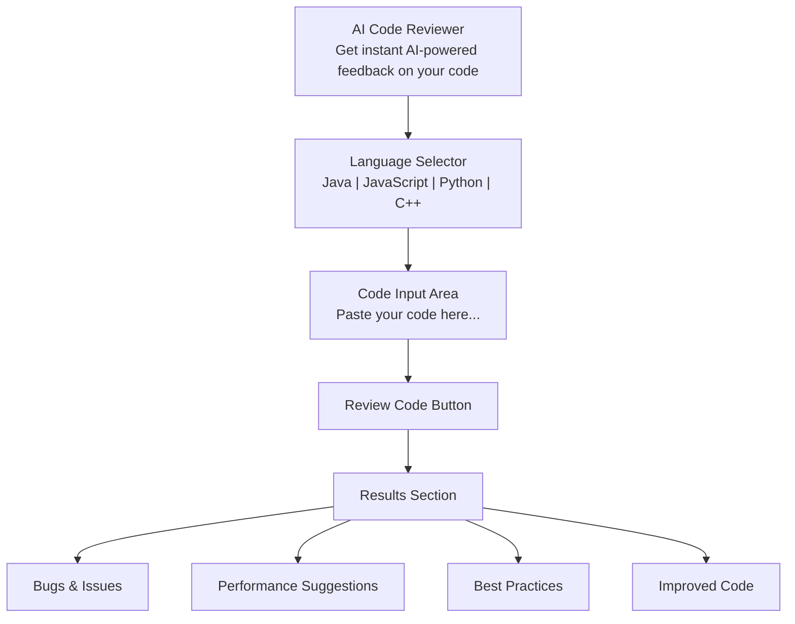
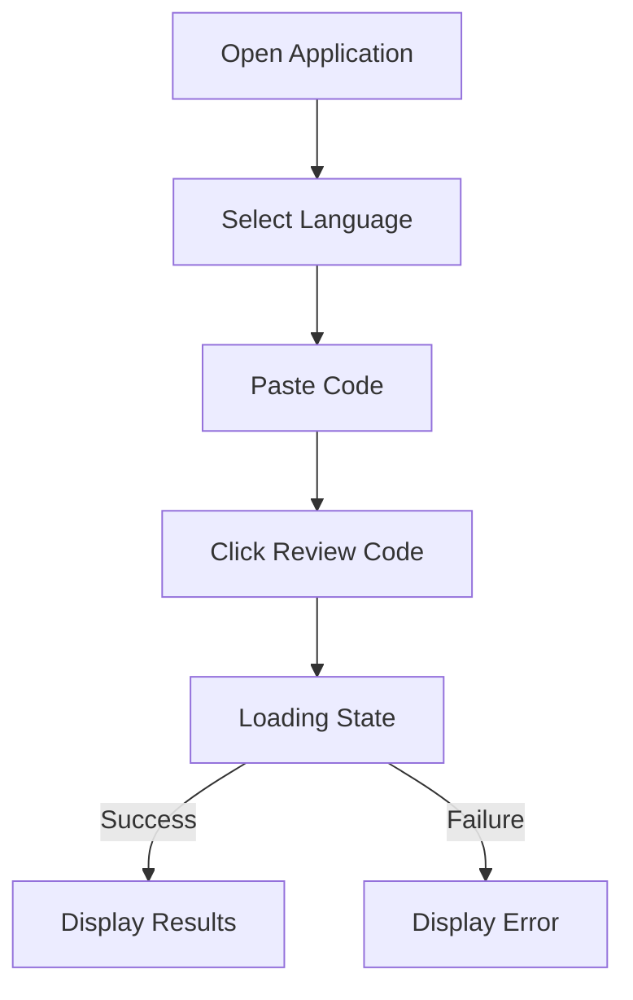
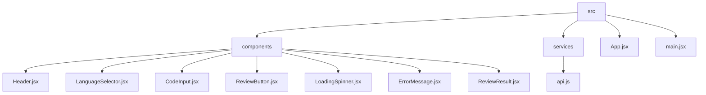
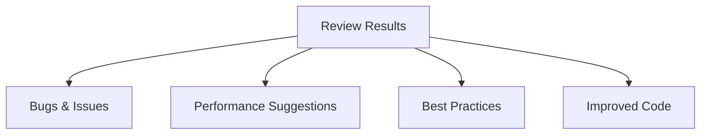
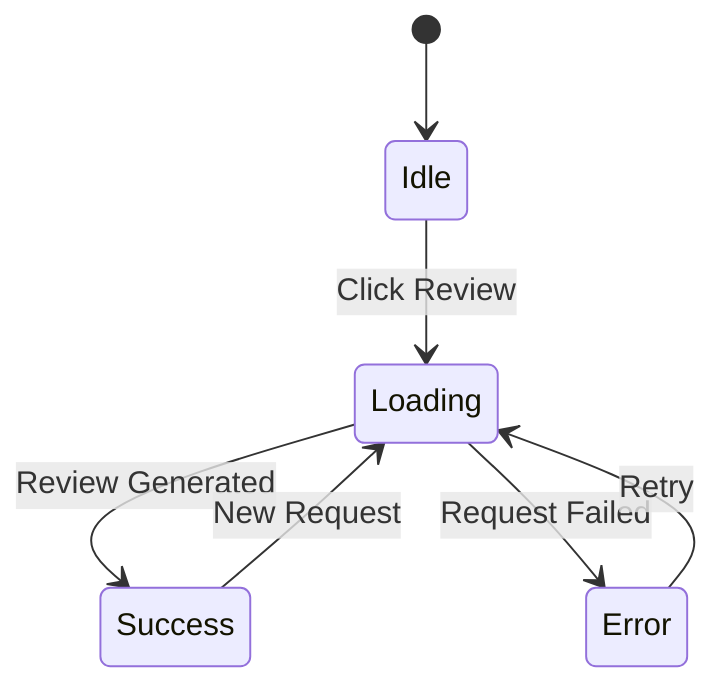
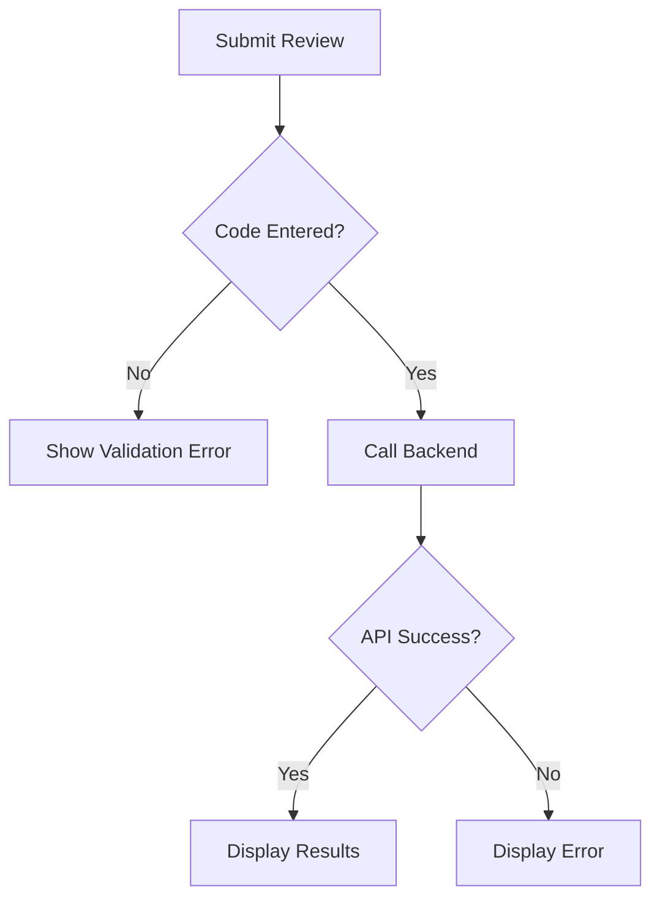
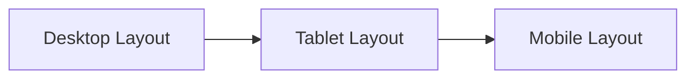
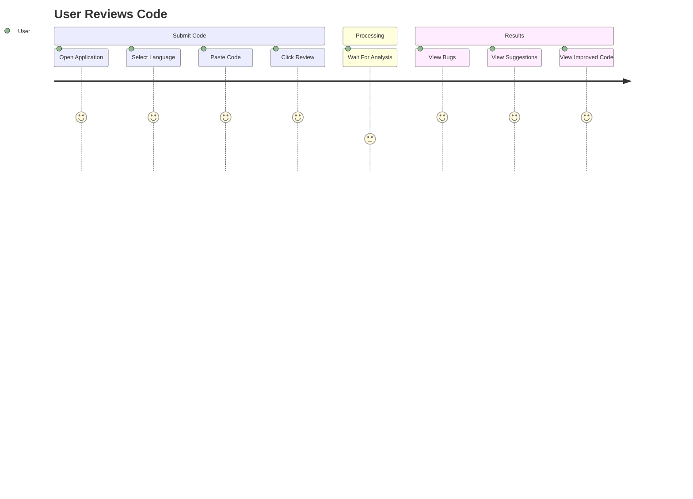

# UI/UX Brief

# AI-Powered Code Reviewer

**Version:** 1.0

---

# 1. Purpose

This document defines the user interface and user experience requirements for the AI-Powered Code Reviewer MVP.

The goal is to create a clean, modern, and developer-friendly interface that allows users to submit code and receive AI-generated feedback with minimal friction.

---

# 2. Design Goals

### Simplicity

Users should understand the application immediately without instructions.

### Fast Interaction

The complete workflow should take less than one minute.

### Readability

AI feedback should be easy to scan and understand.

### Professional Appearance

The interface should resemble a modern developer tool rather than a classroom project.

---

# 3. Application Layout

## Main Screen Layout



---

# 4. User Interaction Flow



---

# 5. Component Structure (React)



---

# 6. Component Details

## Header

Displays:

```text
AI Code Reviewer

Get instant AI-powered feedback on your code.
```

Purpose:

* Introduce application
* Communicate value proposition

---

## LanguageSelector

Dropdown options:

* Java (default)
* JavaScript
* Python
* C++
* Optional: C

Purpose:

Provide context to Gemini during code analysis.

---

## CodeInput

Multi-line textarea.

Requirements:

* Placeholder text
* Monospace font
* Comfortable typing area
* Support large code snippets

Placeholder:

```text
Paste your code here...
```

---

## ReviewButton

Primary Call-To-Action.

Label:

```text
Review Code
```

States:

| State   | Label        |
| ------- | ------------ |
| Default | Review Code  |
| Loading | Reviewing... |

Requirements:

* Disabled during processing
* Visually prominent

---

## LoadingSpinner

Displayed while Gemini is analyzing code.

Text:

```text
Analyzing your code...
```

---

## ReviewResult

Displays:

### Bugs & Issues

Potential bugs or risky patterns.

### Performance Suggestions

Optimization opportunities.

### Best Practices

Maintainability recommendations.

### Improved Code

Refactored version of submitted code.

---

## ErrorMessage

Displayed when validation or API errors occur.

Example:

```text
Unable to generate review. Please try again.
```

---

# 7. Result Section Layout



---

# 8. Visual Style

## Color Palette

| Role         | Color   |
| ------------ | ------- |
| Background   | #0f172a |
| Card Surface | #1e293b |
| Primary      | #7c3aed |
| Text         | #e2e8f0 |
| Muted Text   | #94a3b8 |
| Success      | #10b981 |
| Error        | #ef4444 |

---

## Typography

### Main Text

```text
Inter, sans-serif
```

### Code Blocks

```text
JetBrains Mono, monospace
```

---

# 9. Loading Experience

When user clicks Review Code:

1. Disable button
2. Show loading spinner
3. Hide previous results
4. Wait for Gemini response
5. Display new results

## Loading State Flow



---

# 10. Error States

| Scenario       | Message                                       |
| -------------- | --------------------------------------------- |
| Empty Code     | Please enter code before submitting.          |
| Gemini Failure | Unable to generate review. Please try again.  |
| Network Error  | Connection failed. Please check your network. |

---

## Error Handling Flow



---

# 11. Responsive Design

## Desktop

* Centered layout
* Maximum width container
* Two-column feel for larger screens

---

## Tablet

* Reduced spacing
* Same structure maintained

---

## Mobile

* Fully stacked layout
* Full-width button
* Scrollable code output

---

## Responsive Layout Flow



---

# 12. User Journey



---

# 13. MVP Success Criteria

A user should be able to:

1. Open the application.
2. Select a language.
3. Paste code.
4. Submit for review.
5. Read AI-generated feedback.

---

# 14. UI Success Metrics

The UI is considered successful if:

* User understands the workflow without instructions.
* Code can be submitted in less than one minute.
* Results are easy to scan.
* Errors are understandable.
* Interface works on desktop, tablet, and mobile devices.
* Loading and success states provide clear feedback.
